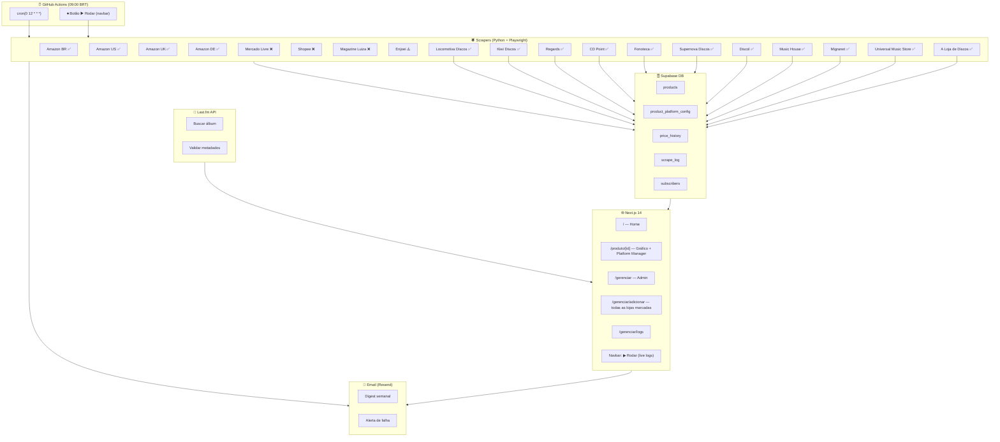

# 💿 CD Price Tracker <sup><sub>v0.13.0</sub></sup>

Acompanhe os preços dos seus CDs favoritos em várias lojas brasileiras. Scraping automático todo dia, histórico em gráfico, e um painel pra você gerenciar sua coleção.



## ✨ O que você pode fazer

- **Ver os preços** dos seus CDs na página inicial — Amazon (BR/US/UK/DE), Mercado Livre, Shopee, tudo num lugar só
- **Clicar no preço** pra ir direto pro anúncio na loja
- **Ver o histórico** de cada CD em gráfico — subiu? caiu? na média?
- **Adicionar CDs** buscando pelo nome ou artista — o Last.fm encontra a capa, ano, gênero
- **Escolher as lojas** que quer monitorar — o sistema descobre o produto sozinho, sem você digitar URL (todas marcadas por padrão)
- **Editar as lojas** de um CD já cadastrado direto na página de detalhe
- **Rodar o scraping na hora** com o botão ▶ Rodar no navbar e ver os logs ao vivo
- **Consultar os logs** de cada execução do scraper — deu certo? falou? por quê?

## 🚀 Como começar

```bash
# Python
pip install -r scraper/requirements.txt
playwright install chromium

# Frontend
cd frontend && npm install

# .env
cp scraper/.env.example scraper/.env.local
cp frontend/.env.example frontend/.env.local
# Preencha SUPABASE_URL, SERVICE_KEY, ADMIN_TOKEN, etc.

# Testar
pytest tests/ -v

# Rodar o scraper manualmente
python -m scraper.main

# Ou via script direto (mesma coisa)
cd scraper && python main.py

# Iniciar o painel web
cd frontend && npm run dev
# Abre em http://localhost:3000
```

## 🖥️ Páginas

| Rota | O que faz |
|---|---|
| `/` | Home — grid dos CDs com o último preço de cada loja |
| `/produto/[id]` | Detalhe do CD + gráfico do histórico + gerenciar lojas |
| `/gerenciar` | Lista os CDs cadastrados, com botão pra remover |
| `/gerenciar/adicionar` | Busca álbum no Last.fm, escolhe as lojas (todas marcadas), salva |
| `/gerenciar/logs` | Tabela com logs de cada execução (status, plataforma, erro) |

### Busca de álbuns

Digita qualquer coisa — "Thriller", "Michael Jackson", ou os dois juntos. O Last.fm devolve os resultados com capa e artista. Depois da busca, aparecem **chips de artista** pra filtrar na hora.

```
🔍 Buscar álbum ou artista...

Filtrar por artista: [Michael Jackson] [Pink Floyd] [Radiohead]

6 resultados encontrados
```

## 🔧 Status dos scrapers

| Loja | Scraper | Status | Extrator |
|---|---|---|---|
| Amazon BR | `amazon.py` | ✅ Funcionando | Playwright + busca automática + fallback de seletores |
| Amazon US | `amazon_global.py` | ✅ Funcionando | Playwright, domínio `.com`, moeda USD |
| Amazon UK | `amazon_global.py` | ✅ Funcionando | Playwright, domínio `.co.uk`, moeda GBP, penalidade de álbum |
| Amazon DE | `amazon_global.py` | ✅ Funcionando | Playwright, domínio `.de`, moeda EUR, penalidade de álbum |
| Locomotiva Discos | `locomotiva.py` | ✅ Funcionando | httpx, Iluria (HTML limpo, sem browser) |
| Kiwi Discos | `kiwi.py` | ✅ Funcionando | Playwright, Nuvemshop |
| Regards | `regards.py` | ✅ Funcionando | Playwright, WooCommerce |
| CD Point | `cdpoint.py` | ✅ Funcionando | Playwright, ASP.NET WebForms |
| Fonoteca | `fonoteca.py` | ✅ Funcionando | httpx, Nuvemshop (JSON-LD) |
| Supernova Discos | `supernova.py` | ✅ Funcionando | httpx, Nuvemshop (JSON-LD) |
| Discol | `discol.py` | ✅ Funcionando | httpx, Nuvemshop (JSON-LD) |
| Music House | `music_house.py` | ✅ Funcionando | httpx, Nuvemshop (JSON-LD) |
| Migranet | `migranet.py` | ✅ Funcionando | httpx, Loja Integrada |
| Universal Music Store | `umusicstore.py` | ✅ Funcionando | httpx, Vtex API de catálogo |
| A Loja de Discos | `loja_discos.py` | ✅ Funcionando | httpx, custom + fallback por categoria |
| Enjoei | `enjoei.py` | ⚠️ Instável | 3 URLs em cascata + API GraphQL + DOM + page.evaluate() |
| Mercado Livre | `mercadolivre.py` | ❌ Bloqueado | CAPTCHA Akamai + API OAuth pendente + Firefox fallback |
| Shopee | `shopee.py` | ❌ Bloqueado | Redireciona pra verificação de tráfego |
| Mag. Luiza | `magalu.py` | ❌ Bloqueado | Akamai 403 na primeira requisição |

**18 lojas configuradas**, sendo **15 funcionais** (httpx/sem browser em 11 delas). Amazon BR/Global com Playwright, Locomotiva e Nuvemshops com httpx puro, Universal Music Store via API Vtex. Enjoei em desenvolvimento com 3 estratégias de extração em cascata. As lojas bloqueadas (ML, Shopee, Magalu) usam anti-bot pesado (Akamai, DataDome). Plano futuro: **API oficial Mercado Livre** (OAuth) e **Google Shopping API** como fontes alternativas.

## 📦 Stack

| Camada | Tecnologia |
|---|---|
| Scrapers | Python + Playwright + playwright-stealth |
| Agendamento | GitHub Actions (todo dia às 09:00 BRT) |
| Banco de dados | Supabase (free tier — Postgres + RLS + API) |
| Validação de álbuns | Last.fm API |
| Frontend | Next.js 14 (App Router) + Recharts |
| Testes | Pytest (51 unit + mock, zero chamadas externas) |
| Notificações | Resend (futuro) |

## 📁 Estrutura do projeto

```
cd-price-tracker/
├── scraper/               # Python — tudo que roda o scraping
│   ├── main.py            # Orquestrador — coordena tudo
│   ├── amazon.py          # Amazon BR ✅ funcionando
│   ├── amazon_global.py   # Amazon US/UK/DE ✅ funcionando
│   ├── mercadolivre.py    # ML ❌ bloqueado (fallback)
│   ├── mercadolivre_api.py# ML API oficial OAuth ⏳ pendente
│   ├── shopee.py          # Shopee ❌ bloqueado
│   ├── magalu.py          # Magalu ❌ bloqueado
│   ├── enjoei.py          # Enjoei ⚠️ instável (API + DOM + evaluate)
│   ├── locomotiva.py      # Locomotiva Discos ✅ (httpx, Iluria)
│   ├── kiwi.py            # Kiwi Discos ✅ (Playwright, Nuvemshop)
│   ├── regards.py         # Regards ✅ (Playwright, WooCommerce)
│   ├── cdpoint.py         # CD Point ✅ (Playwright, ASP.NET)
│   ├── fonoteca.py        # Fonoteca 🆕 (httpx, Nuvemshop)
│   ├── supernova.py       # Supernova Discos 🆕 (httpx, Nuvemshop)
│   ├── discol.py          # Discol 🆕 (httpx, Nuvemshop)
│   ├── music_house.py     # Music House 🆕 (httpx, Nuvemshop)
│   ├── migranet.py        # Migranet 🆕 (httpx, Loja Integrada)
│   ├── umusicstore.py     # Universal Music Store 🆕 (httpx, Vtex API)
│   ├── loja_discos.py     # A Loja de Discos 🆕 (httpx, custom)
│   ├── nuvemshop.py       # Base scraper Nuvemshop (httpx + JSON-LD)
│   ├── filter.py          # Filtro anti-fanmade
│   ├── utils.py           # normalize, token_similarity, first_selector, best_match
│   ├── price_parser.py    # "R$ 49,90" → 49.90
│   ├── alert.py           # Alerta de falha no pipeline
│   └── email_digest.py    # Digest com variação de preços
├── frontend/              # Next.js 14
│   ├── app/
│   │   ├── page.tsx               # Home
│   │   ├── produto/[id]           # Detalhe + gráfico + platform manager
│   │   ├── gerenciar/             # Admin
│   │   ├── api/                   # API routes
│   │   │   ├── scrape/trigger     # POST ▶ Rodar
│   │   │   └── albums/[id]/platforms  # PATCH gerenciar lojas
│   │   └── layout.tsx             # Navbar com ▶ Rodar
    │   ├── components/
    │   │   ├── scrape-button.tsx      # Botão ▶ Rodar + live logs
    │   │   ├── platform-manager.tsx   # Gerenciar lojas do CD
    │   │   ├── platform-form.tsx      # Formulário de adicionar (todas marcadas)
    │   │   ├── album-search.tsx       # Busca Last.fm
    │   │   ├── admin-auth.tsx         # Login admin (com olho p/ senha)
    │   │   ├── confirm-modal.tsx      # Modal de confirmação reutilizável
    │   │   ├── toast.tsx              # Notificação auto-dismiss
    │   │   ├── error-boundary.tsx     # ErrorBoundary classe
    │   │   ├── price-card.tsx         # Card de preço
    │   │   └── price-chart.tsx        # Gráfico recharts
    │   └── lib/
    │       └── platforms.ts          # ALL_PLATFORMS, labels, icons, badges
├── supabase/              # SQL do banco
├── tests/                 # 99 testes mockados
└── .github/workflows/     # CI/CD
```

## 📊 Dashboard

A home exibe todos os CDs em um grid responsivo. Cada card mostra a capa, o artista e os preços em todas as lojas monitoradas.

```
┌──────────────────────────────────────────────────┐
│  💿  Thriller — Michael Jackson                  │
│                                                  │
│  🇧🇷 Amazon BR     R$ 44,90    🛒   📈            │
│  🇺🇸 Amazon US     $ 12,95     🛒   📈            │
│  🇬🇧 Amazon UK     £ 11,20     🛒   📈            │
│  🇩🇪 Amazon DE     € 13,40     🛒   📈            │
│  🎶 Fonoteca      R$ 44,90    🛒   📈            │
│  🎤 Universal     R$ 59,90    🛒   📈            │
│  🌐 Migranet      R$ 49,90    🛒   📈            │
│  💥 Supernova     R$ 69,90    🛒   📈            │
│  🎯 Discol        R$ 54,90    🛒   📈            │
│  🎼 Music House   R$ 49,90    🛒   📈            │
│  🏪 A Loja Discos R$ 39,90    🛒   📈            │
│  🚂 Locomotiva    R$ 44,90    🛒   📈            │
│  🥝 Kiwi          R$ 42,00    🛒   📈            │
│  🎵 Regards       R$ 47,90    🛒   📈            │
│  💿 CD Point      R$ 89,90    🛒   📈            │
│  🟡 Mercado Livre    —   sem preço                │
│  🛍️ Shopee        R$ 39,90    🛒   📈            │
│  💛 Enjoei        R$ 52,00    🛒   📈            │
└──────────────────────────────────────────────────┘
```

**🛒 Clique no preço** → abre o anúncio direto na loja.  
**📈 Clique no gráfico** → abre página de detalhe com o histórico completo de preços e o gerenciamento de plataformas.  
**🔄 Clique em "▶ Rodar" na navbar** → executa o scraper em tempo real com logs ao vivo via SSE, sem esperar o cron diário.

### Funcionalidades do dashboard

- **Ordenação automática** — CDs mais recentes ou por nome
- **Badges das lojas** — cada loja tem um badge de 2 letras (BR, ML, FN, SN, etc.) para fácil identificação
- **Preço mais baixo destacado** — a loja com o menor preço aparece em primeiro lugar no card
- **Status visual** — moedas diferentes (R$, $, £, €) conforme a origem do produto
- **Indisponível identificado** — lojas sem preço mostram "— sem preço" em vez de ocultar o registro

## 🧪 Testes

**116 testes**. Zero chamadas externas. Tudo mockado com pytest-mock.

| Arquivo | O que testa |
|---|---|
| `test_amazon.py` | `_normalize`, `_token_similarity`, `scrape_amazon` (5 cenários), `search_amazon` (5) |
| `test_main.py` | `auto_search_query`, `choose_lowest_price`, `persist_result` |
| `test_filter.py` | 16 casos de fanmade detection |
| `test_shopee.py` | API + fallback Playwright |
| `test_mercadolivre.py` | API + Playwright fallback |
| `test_models.py` | Dataclasses `ScrapedProduct` e `ScrapeResult` |
| `test_price_parser.py` | 11 formatos de preço brasileiro (inclui `None`) |
| `test_utils.py` | normalize, token_similarity, first_selector, best_match |
| `test_email_digest.py` | Renderização do template HTML |
| `test_alert.py` | Envio de alerta por email |
| `test_validate_albums.py` | Last.fm client, score, imagem |

## 🔭 O que vem por aí

**18 lojas implementadas**, 15 funcionais. O foco agora é destravar as lojas bloqueadas:

1. **API oficial do Mercado Livre** — app registrado, aguardando aprovação (OAuth). Se funcionar, resolve ML sem browser.
2. **Google Shopping API** — fonte agregada que cobre várias lojas numa chamada só.
3. **VPS com browser headful** — rodar Playwright com janela visível pra lojas com Akamai.
4. **Buscapé / Zoom** — comparadores que podem listar preços das lojas bloqueadas.

Veja o [TODO.md](TODO.md) completo.

## 📄 Licença

MIT © [Lucas Cavalcante dos Santos](LICENSE) — usa, modifica, compartilha.
