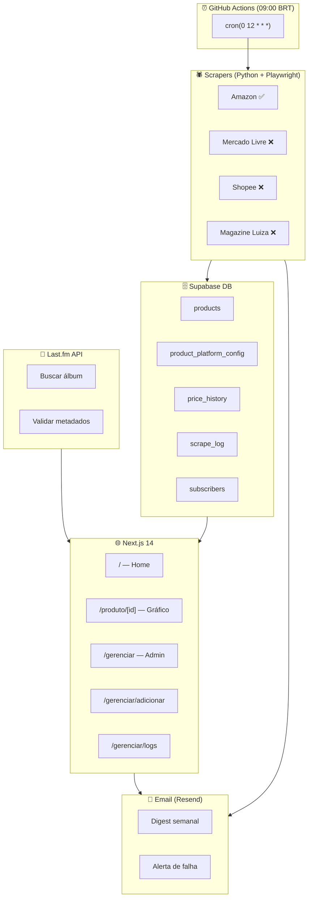

# 💿 CD Price Tracker

Acompanhe os preços dos seus CDs favoritos em várias lojas brasileiras. Scraping automático todo dia, histórico em gráfico, e um painel pra você gerenciar sua coleção.



## ✨ O que você pode fazer

- **Ver os preços** dos seus CDs na página inicial — Amazon, Mercado Livre, Shopee, tudo num lugar só
- **Clicar no preço** pra ir direto pro anúncio na loja
- **Ver o histórico** de cada CD em gráfico — subiu? caiu? na média?
- **Adicionar CDs** buscando pelo nome ou artista — o Last.fm encontra a capa, ano, gênero
- **Escolher as lojas** que quer monitorar — o sistema descobre o produto sozinho, sem você digitar URL
- **Consultar os logs** de cada execução do scraper — deu certo? falou? por quê?

## � Como começar

```bash
# Python
pip install -r scraper/requirements.txt
playwright install chromium

# Frontend
cd frontend && npm install

# .env
cp scraper/.env.example scraper/.env
cp frontend/.env.example frontend/.env.local
# Preencha SUPABASE_URL, SERVICE_KEY, ADMIN_TOKEN, etc.

# Testar
pytest tests/ -v

# Rodar o scraper manualmente
python scraper/main.py

# Iniciar o painel web
cd frontend && npm run dev
# Abre em http://localhost:3000
```

## 🖥️ Páginas

| Rota | O que faz |
|---|---|
| `/` | Home — grid dos CDs com o último preço de cada loja |
| `/produto/[id]` | Detalhe do CD + gráfico do histórico de preços |
| `/gerenciar` | Lista os CDs cadastrados, com botão pra remover |
| `/gerenciar/adicionar` | Busca álbum no Last.fm, escolhe as lojas, salva |
| `/gerenciar/logs` | Tabela com logs de cada execução (status, plataforma, erro) |

### Busca de álbuns

Digita qualquer coisa — "Thriller", "Michael Jackson", ou os dois juntos. O Last.fm devolve os resultados com capa e artista. Depois da busca, aparecem **chips de artista** pra filtrar na hora.

```
🔍 Buscar álbum ou artista...

Filtrar por artista: [Michael Jackson] [Pink Floyd] [Radiohead]

6 resultados encontrados
```

## 🔧 Status dos scrapers

| Loja | Scraper | Funcionando? | Observação |
|---|---|---|---|
| Amazon | `amazon.py` | ✅ Sim | Busca automática + fallback de seletores. O mais confiável. |
| Mercado Livre | `mercadolivre.py` | ❌ Bloqueado | CAPTCHA anti-bot agressivo (Akamai) |
| Shopee | `shopee.py` | ❌ Bloqueado | Redireciona pra verificação de tráfego |
| Magazine Luiza | `magalu.py` | ❌ Bloqueado | Akamai 403 na primeira requisição |

**Resumo:** Amazon é a única loja que funciona 100%. As lojas brasileiras usam anti-bot pesado (Akamai, DataDome) que bloqueia até Playwright com stealth. A solução de médio prazo é integrar **Google Shopping API** como fonte agregada.

## 📦 Stack

| Camada | Tecnologia |
|---|---|
| Scrapers | Python + Playwright + playwright-stealth |
| Agendamento | GitHub Actions (todo dia às 09:00 BRT) |
| Banco de dados | Supabase (free tier — Postgres + RLS + API) |
| Validação de álbuns | Last.fm API |
| Frontend | Next.js 14 (App Router) + Recharts |
| Testes | Pytest (99 testes — todos mockados) |
| Notificações | Resend (futuro) |

## 📁 Estrutura do projeto

```
cd-price-tracker/
├── scraper/               # Python — tudo que roda o scraping
│   ├── main.py            # Orquestrador — coordena tudo
│   ├── amazon.py          # Amazon ✅ funcionando
│   ├── mercadolivre.py    # ML ❌ bloqueado
│   ├── shopee.py          # Shopee ❌ bloqueado
│   ├── magalu.py          # Magalu ❌ bloqueado
│   ├── filter.py          # Filtro anti-fanmade
│   ├── price_parser.py    # "R$ 49,90" → 49.90
│   ├── alert.py           # Alerta de falha no pipeline
│   └── email_digest.py    # Digest com variação de preços
├── frontend/              # Next.js 14
│   ├── app/
│   │   ├── page.tsx              # Home
│   │   ├── produto/[id]          # Detalhe + gráfico
│   │   ├── gerenciar/            # Admin
│   │   └── api/                  # API routes
│   └── components/
├── supabase/              # SQL do banco
│   ├── schema.sql         # CREATE TABLEs
│   ├── rls.sql            # Regras de segurança
│   └── seed.sql           # Dados de exemplo
├── tests/                 # 99 testes mockados
└── .github/workflows/     # CI/CD
```

## 📊 Dashboard

Quando você abre a home, vê os CDs assim:

```
┌──────────────────────────────────┐
│  💿  Thriller                    │
│      Michael Jackson             │
│                                 │
│  Amazon: R$ 44,90     🛒        │
│  Mercado Livre: R$ 59,90  🟡    │
│  Shopee: R$ 39,90       🛍️      │
└──────────────────────────────────┘
```

Clica no preço → abre o anúncio. Clica no card → abre o gráfico do histórico.

## 🧪 Testes

99 testes, zero chamadas externas. Tudo mockado com pytest-mock.

| Arquivo | O que testa |
|---|---|
| `test_amazon.py` | `_normalize`, `_token_similarity`, `scrape_amazon` (5 cenários), `search_amazon` (5) |
| `test_main.py` | `auto_search_query`, `choose_lowest_price`, `persist_result` |
| `test_filter.py` | 16 casos de fanmade detection |
| `test_shopee.py` | API + fallback Playwright |
| `test_mercadolivre.py` | API + Playwright fallback |
| `test_models.py` | Dataclasses `ScrapedProduct` e `ScrapeResult` |
| `test_price_parser.py` | 10 formatos de preço brasileiro |
| `test_email_digest.py` | Renderização do template HTML |
| `test_alert.py` | Envio de alerta por email |
| `test_validate_albums.py` | Last.fm client, score, imagem |

## 🔭 O que vem por aí

A Amazon funciona bem. O plano agora é buscar fontes alternativas que não sejam bloqueadas por anti-bot:

1. **Google Shopping API** — fonte agregada que cobre várias lojas numa chamada só
2. **API oficial do Mercado Livre** — precisa de app registrado (OAuth), mas pode destravar ML
3. **VPS com browser headful** — rodar o Playwright com janela visível pra lojas com Akamai

Veja o [TODO.md](TODO.md) completo.

## 📄 Licença

MIT — usa, modifica, compartilha.
